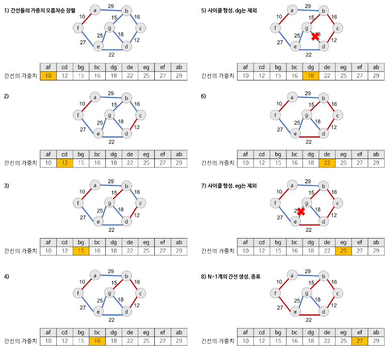
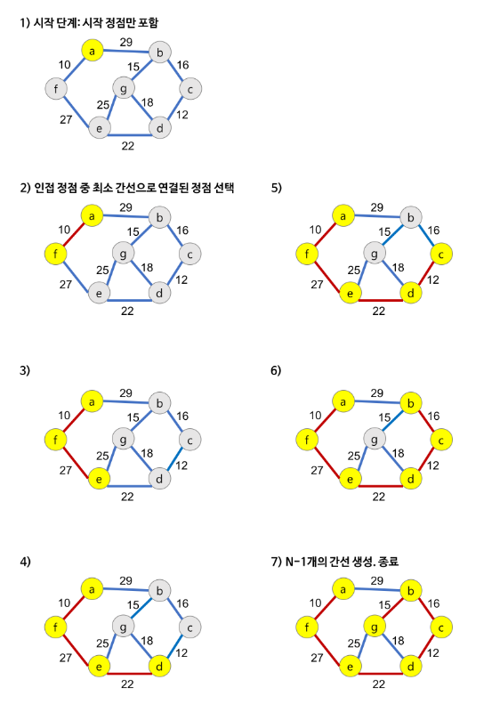

## 그래프

### DFS, BFS 알고리즘의 기본

- 1260번 문제 확인

### Union Find 알고리즘

- 여러 노드가 존재할 때, 두 개의 노드를 선택해서 현재 두 노드가 서로 같은 그래프에 속하는지 판별하는 알고리즘
- 2가지 연산으로 이루어짐.
    - Find: x가 어떤 집합에 포함되어 있는지 찾는 연산
    - Union: x와 y가 포함되어 있는 집합을 합치는 연산
        - 부모를 합칠 때에는 더 작은 값 쪽으로 합침.
- Disjoint Set(상호 배타적 집합, 서로소 집합)을 표현할 수 있음.
- 셀프루프(self-loop : 자기자신을 가리키는 간선)을 포함하면 안되고 무방향그래프에서 사이클을 찾는데 유용함.
- 1717번 문제, 1976번 문제

```
fun union(x: Int, y: Int) {
    val a = find(x)
    val b = find(y)

    if (a < b)
        parent[b] = a
    else
        parent[a] = b
}

fun find(x: Int): Int {
    if (x == parent[x]) return parent[x]
    else {
        parent[x] = find(parent[x])
        return parent[x]
    }
}

fun isSameParent(x: Int, y: Int): Boolean {
    val a = find(x)
    val b = find(y)

    return a == b
}
```

- https://brenden.tistory.com/33
- https://velog.io/@woo0_hooo/%EC%95%8C%EA%B3%A0%EB%A6%AC%EC%A6%98-union-find-%EC%95%8C%EA%B3%A0%EB%A6%AC%EC%A6%98

### 크루스칼 알고리즘

- greedy method를 이용해 그래프에서 최소 비용 신장 부분 트리(최소 신장 트리: Minimum Spanning Tree)를 찾는 알고리즘
    - MST의 특징
        - 간선의 가중치의 합이 최소여야 함.
        - n개의 정점을 가지는 그래프에 대해 반드시 (n-1)개의 간선만을 사용해야 함.
        - 사이클이 포함되면 안됨.
- 각 단계에서 사이클을 이루지 않는 최소 비용 간선을 선택하며, "간선 선택"을 기반으로 하는 알고리즘
- 이전 단계에서 만들어진 신장 트리와는 상관 없이 무조건 최소 간선만을 선택하는 방법임.
- 두 노드를 연결했을 때 사이클이 생기는지 확인해야 함. 이때 유니온 파인드 알고리즘 사용해 확인.

- 예시

   


- 1922번 문제

```
while (numberOfVertexInMST < numberOfComputer - 1) {
    val node = pq.poll()
    val x = node.start
    val y = node.end

    // 사이클 없는 것 확인
    if (findParent(x) != findParent(y)) {
        // union
        unionComputer(x, y)

        // 비용 합치기
        minCost += node.cost
        numberOfVertexInMST++
    }
}
```

- https://gmlwjd9405.github.io/2018/08/28/algorithm-mst.html

### 프림 알고리즘

- 시작 정점에서부터 출발해 신장트리 집합을 단계적으로 확장해나가며 최소 신장 부분 트리를 찾는 알고리즘
- "정점 선택"을 기반으로 하는 알고리즘
- 이전 단계에서 만들어진 신장 트리를 확장하는 방법임.
- 예시

     

- 1647번 문제
```
PriorityQueue<Node> pq = new PriorityQueue<>();
boolean[] visited = new boolean[N+1];
pq.add(new Node(1, 0));
int dist = 0;
int numOfVisitedNode = 0;

while (!pq.isEmpty()) {
  Node node = pq.poll();
  int v = node.v;
  int w = node.w;
  
  if (visited[v]) {
    continue;
  }
  
  visited[v] = true;
  numOfVisitedNode++;
  dist += w;
  
  if (numOfVisitedNode >= numOfHouse) {
    break;
  }
  
  for (Node linkedNode : nodes[v]) {
    if (!visited[linkedNode.v]) {
      pq.add(linkedNode);
    }
  }
}
```

- https://kwin0825.tistory.com/77
- https://toastfactory.tistory.com/184
- https://www.weeklyps.com/entry/%ED%94%84%EB%A6%BC-%EC%95%8C%EA%B3%A0%EB%A6%AC%EC%A6%98-Prims-algorithm

### 다익스트라 알고리즘

- 특정한 하나의 정점에서 다른 모든 정점으로 가는 최단 경로를 찾는 알고리즘
- 하나의 최단 거리를 구할 때 그 이전까지 구했던 최단 거리 정보를 그대로 사용함. ➡ 동적 프로그래밍을 활용한 알고리즘
- 매번 가장 비용이 적은 노드를 선택함. ➡ 그리디 알고리즘
- 1238번 문제

```
/* 우선순위 큐로 구현 */
// 시간복잡도: O(e*logm) (m: 노드의 개수, e: 간선의 개수)

fun dijkstra(v: Int, n: Int, graph: Array<IntArray>) {
    val pq = PriorityQueue<Node>()
    val distance = IntArray(n+1) {Integer.MAX_VALUE}

    pq.offer(Node(v, 0))
    distance[v] = 0

    while (!pq.isEmpty()) {
        val node = pq.poll()
        val dist = node.distance
        val index = node.index

        if (distance[index] < dist) continue

        for (i in 1..n) {
            // 연결되어 있을 때
            val const = distance[index] + graph[index][i]
            if (graph[index][i] != 0 &&  const < distance[i]) {
                distance[i] = const
                pq.offer(Node(i, distance[i]))
            }
        }
    }
}

class Node(val index: Int, val distance: Int) : Comparable<Node> {
    override fun compareTo(other: Node): Int {
        if (distance < other.distance) return -1
        return 1
    }
}
```

- https://devfunny.tistory.com/641

```
// 시간복잡도: O(m^2) (m: 노드의 개수)
// v: 시작 정점, n: 정점의 수

fun dijkstra(v: Int, n: Int, graph: Array<IntArray>) {
    val visited = BooleanArray(n + 1)
    val distance = IntArray(n+1) { Integer.MAX_VALUE }

    distance[v] = 0
    visited[v] = true

    // 최단거리 업데이트
    for (i in 1..n) {
        if (!visited[i] && graph[v][i] != 0) {
            distance[i] = graph[v][i]
        }
    }

    // 모든 정점에 대해 반복
    for (i in 1 until n) {
        // distance 중 최단거리 찾기
        var minDistance = Integer.MAX_VALUE
        var minIndex = -1

        for (j in 1..n) {
            if (!visited[j] && minDistance > distance[j]) {
                minDistance = distance[j]
                minIndex = j
            }
        }

        visited[minIndex] = true

        // 최단거리 업데이트하기
        for (j in 1..n) {
            // 연결되어 있는지 확인
            if (!visited[j] && graph[minIndex][j] != 0) {
                distance[j] =
                    min(distance[j], distance[minIndex] + graph[minIndex][j])
            }
        }
    }
}
```

- https://devfunny.tistory.com/638
- https://gomgomkim.tistory.com/19

### 플로이드 워셜 알고리즘

- ...

<br>

## ETC

- 코틀린 기준 11724번 문제 4등~~!

    

- 코틀린 기준 1707번 문제 6등!

    
  

    - 정말 오랜 시간이 걸렸다. 약 13번의 도전 후 성공...
    - 처음에는 입력받은 vertex + 1 크기의 2차원 배열에 인접 vertex를 표현하였으나 메모리 초과. 실제로 이렇게 하면 문제에서 제한된 메모리를 훨씬 초과했다.
    - 그래서 Array<Int>{ mutableListOf() }로 배열을 생성한 뒤, 인접한 vertex가 있는 경우에만 해당 인덱스에 맞춰 list에 넣어주는 방식으로
      변경함.
    - 그러나 그 이후 계속 시간초과가 떴고, 그 원인은 너무 많은 반복문의 사용(특히 범위)가 컸음.
    - 그리고 성공! 어제부터 시도해본 문제인데 풀어서 행복하고, 상위권이라 기분이 좋다.
    - dfs가 좀 더 편해서 dfs로 풀었는데 나중에 bfs로 풀어보는 것도 좋을 것 같다.

- 10451번 문제 1등!

  

- 2331번 문제도 1등~

  

- 1922번 문제 1등~
    - 첫 시도에서는 2등이었는데, while(!pq.isEmpty()) 대신 MST의 성립조건 중 하나인 "n개의 정점을 가지는 그래프에 대해 반드시 (n-1)개의 간선만을
      사용해야 함."을 만족시키면 반복 종료되도록 while(numberOfVertexInMST < numberOfComputer-1)로 변경함.

  

- 7576번 문제 8등!

  